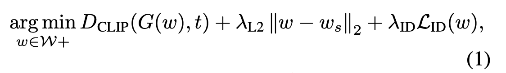

# StyleCLIP-Pytorch_Happydog

## Results Showcase
### Images


### Videos
video 1

https://github.com/user-attachments/assets/503fa6ce-b7ea-4841-b23a-087aabfd45d1

video 2

https://github.com/user-attachments/assets/7c1ee0cc-57ff-4040-83fa-8a52a59627dd

## Latent Optimization Step

A simple approach for leveraging CLIP to guide image manipulation is through direct latent code optimization. This method involves three essential components:

1. **Requirements**:
   - A pre-trained StyleGAN model.
   - A source latent code (usually generated from random noise \( z \) by the mapper from the generator; we can also perform image inversion using e4e to edit the image of our choice).
   - A pre-trained CLIP model.

2. **Loss Function**:

   The loss function consists of three parts:
   - **CLIP Loss** $$\( D_{clip} \)$$: This calculates the cosine distance between the CLIP embeddings of the text and image arguments, where $$G$$ is a pre-trained StyleGAN generator and $$t$$ is the text prompt.
   - **L2 Norm**: This part calculates the L2 distance between the source latent code $$w_s$$ and the target latent code $$w$$.
   - **Identity Loss**: Ensures that the identity of the image remains unchanged while allowing modifications to other visual features (e.g., hairstyle, expression, presence of glasses, etc.). The identity loss is calculated using a pre-trained ArcFace network for face recognition.

3. **Finding the Optimized $$w$$**:
   We find the optimized $$w$$ by solving the optimization problem through gradient descent. The gradient of the objective function is backpropagated while freezing the pre-trained StyleGAN and CLIP models. Typically, using an epoch count of 150 to 250 will yield decent results. The $\lambda 2$ parameter usually ranges from 0.02 to 0.06, depending on the extent to which you want to change your photo. The $\lambda_ID$ parameter is only appied when editing human faces.

## Getting Started

### Install Pre-trained CLIP Model
To install the pre-trained CLIP model, run the following command:

```bash
pip install git+https://github.com/openai/CLIP.git
```
### Install Ninja
To install Ninja, execute the following commands:
```bash
!wget https://github.com/ninja-build/ninja/releases/download/v1.8.2/ninja-linux.zip
!sudo unzip ninja-linux.zip -d /usr/local/bin/
!sudo update-alternatives --install /usr/bin/ninja ninja /usr/local/bin/ninja 1 --force
```
### Get Pre-trained StyleGAN
Clone the StyleGAN repository:
```bash
!git clone https://github.com/NVlabs/stylegan2-ada-pytorch.git
%cd stylegan2-ada-pytorch
```

## Problems Encountered During This Project

1. **Using Pre-trained StyleGAN Model**: Install Ninja and modify the code in `torch.utils`.
2. **Using Mac**: Unable to train the network due to an unknown reason. The error message was: Expected scalar_type == ScalarType::Float || inputTensor.scalar_type() == ScalarType::Int || scalar_type == ScalarType::Bool to be true, but got false.
3. **CLIP Installation**: Install directly from OpenAI's CLIP to avoid errors. Do not use `pip install CLIP`.
4. **Loss Function Parameters**: Adjust the parameters in the loss function to achieve the ideal result.

# Global Directions for Image Manipulation Using Text Prompts

## Objective
The goal is to manipulate an image based on a given text prompt, $ t $, that indicates a desired attribute. Specifically, we aim to find a manipulation direction, $ \Delta s $, such that generating an image $ G(s + \alpha \Delta s) $ produces a result consistent with the desired manipulation encoded in the text prompt.

## Approach
We map any text prompt $ \Delta t $ into a single, global direction in the style space of StyleGAN.

### Key Intuitions
1. In well-trained regions of the CLIP model, we anticipate that similar changes in image embeddings and text embeddings correspond to strong cosine similarity.
2. Given two images, $ G(s) $ and $ G(s + \alpha \Delta s) $, their respective CLIP embeddings, $i$ and $ i + \Delta i $, can be computed. The text prompt is encoded as $ \Delta t $. By assessing the cosine similarity between $ \Delta t $ and $\Delta i$, we can determine the manipulation direction, $\Delta s$.

### Methodology

1. **Natural Language Instruction $(\Delta t )$**  
   Using a pre-defined text prompt bank (e.g., ImageNet), we generate phrases such as "a bad photo of \{\}", "a photo of a small \{\}," etc., to produce average embeddings for both the target and neutral classes. These embeddings allow us to calculate the normalized difference.

2. **Channel-Wise Manipulation**  
   Perform channel-wise manipulation, $ \alpha \Delta s $, on the style code $ s $ over several image pairs.

3. **Channel Relevance Calculation**  
   For each channel in the StyleGAN style space, project the CLIP space direction $ \Delta i_c $ onto the corresponding manipulation direction $ \Delta i $ to calculate the relevance.

4. **Apply Manipulation Direction \( \Delta s \)**  
   Apply the computed manipulation direction $ \Delta s $ to the intended image, generating a modified image consistent with the desired attribute indicated by the text prompt.

### Formal Expression

$$
\Delta s = \begin{cases}
\Delta i_c \cdot \Delta i & \text{if } \Delta i_c \cdot \Delta i \geq \beta \\
0 & \text{otherwise}
\end{cases}
$$

In this formula, $ \Delta i_c $ represents the channel-wise change in CLIP image embeddings, $ \Delta i $ is the text-based direction, and $ \beta $ is a threshold to ensure significant manipulation.


## References

1. [stylegan2-ada-pytorch](https://github.com/NVlabs/stylegan2-ada-pytorch) StyleGAN2-ADA — Official PyTorch implementation

2. [encoder for editing](https://github.com/omertov/encoder4editing) e4e — encoder for editing

3. [CLIP](https://github.com/openai/CLIP)
