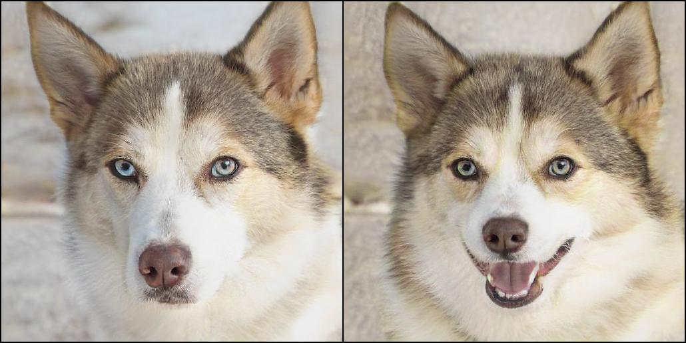
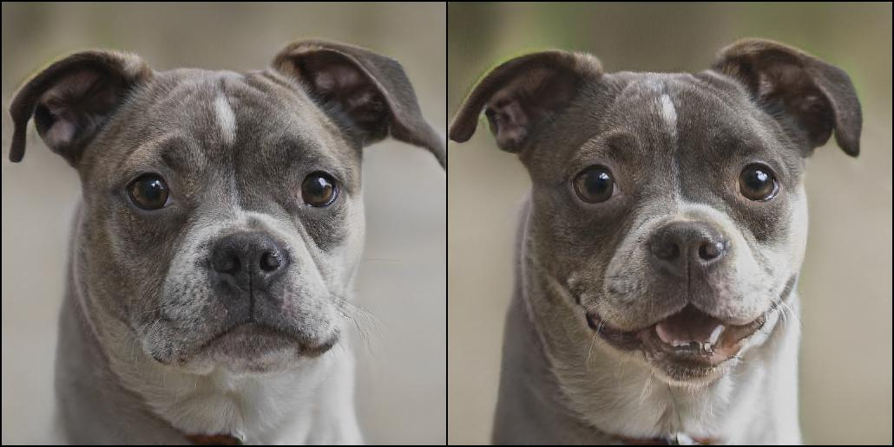
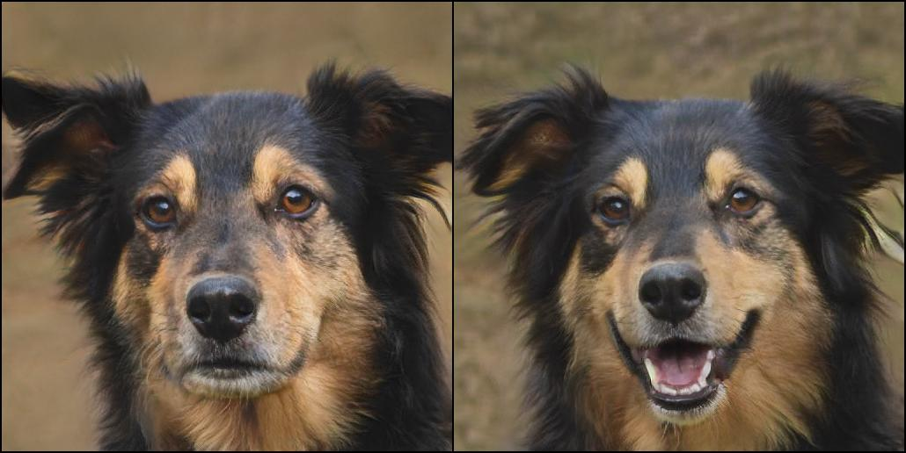

# StyleCLIP-Pytorch_Happydog

## Results Showcase
### Images




### Videos
video 1

https://github.com/user-attachments/assets/503fa6ce-b7ea-4841-b23a-087aabfd45d1

video 2

https://github.com/user-attachments/assets/7c1ee0cc-57ff-4040-83fa-8a52a59627dd

## Latent Optimization Step

A simple approach for leveraging CLIP to guide image manipulation is through direct latent code optimization. This method involves three essential components:

1. **Requirements**:
   - A pre-trained StyleGAN model.
   - A source latent code (usually generated from random noise \( z \) by the mapper from the generator; we can also perform image inversion using e4e to edit the image of our choice).
   - A pre-trained CLIP model.

2. **Loss Function**:
‘’‘math
\text{arg min} \ D_{\text{CLIP}}(G(w), t) + \lambda_{L2} \| w - w_s \|_2 + \lambda_{ID} L_{ID}(w), 
\quad w \in W^+’
'''

   The loss function consists of three parts:
   - **CLIP Loss** \( D_{clip} \): This calculates the cosine distance between the CLIP embeddings of the text and image arguments, where \( G \) is a pre-trained StyleGAN generator and \( t \) is the text prompt.
   - **L2 Norm**: This part calculates the L2 distance between the source latent code \( w_s \) and the target latent code \( w \).
   - **Identity Loss**: Ensures that the identity of the image remains unchanged while allowing modifications to other visual features (e.g., hairstyle, expression, presence of glasses, etc.). The identity loss is calculated using a pre-trained ArcFace network for face recognition.

   

4. **Finding the Optimized \( w \)**:
   We find the optimized \( w \) by solving the optimization problem through gradient descent. The gradient of the objective function is backpropagated while freezing the pre-trained StyleGAN and CLIP models.

## Getting Started

### Install Pre-trained CLIP Model
To install the pre-trained CLIP model, run the following command:

```bash
pip install git+https://github.com/openai/CLIP.git
```
### Install Ninja
To install Ninja, execute the following commands:
```bash
!wget https://github.com/ninja-build/ninja/releases/download/v1.8.2/ninja-linux.zip
!sudo unzip ninja-linux.zip -d /usr/local/bin/
!sudo update-alternatives --install /usr/bin/ninja ninja /usr/local/bin/ninja 1 --force
```
### Get Pre-trained StyleGAN
Clone the StyleGAN repository:
```bash
!git clone https://github.com/NVlabs/stylegan2-ada-pytorch.git
%cd stylegan2-ada-pytorch
```

## References

1. [stylegan2-ada-pytorch](https://github.com/NVlabs/stylegan2-ada-pytorch) StyleGAN2-ADA — Official PyTorch implementation

2. [encoder for editing]([https://github.com/NVlabs/stylegan2-ada-pytorch](https://github.com/omertov/encoder4editing)) e4e — encoder for editing

3. [CLIP](https://github.com/openai/CLIP)
